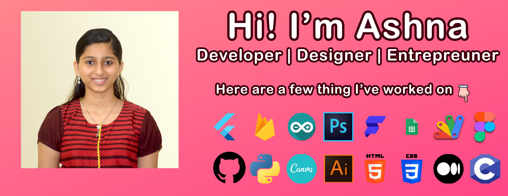

 

 
 

  

 
 
I am a Flutter developer passed out from College of Engineering Trivandrum. I have experience working with REST API's, Firebase backend, Figma and a bit of google appscript. I have also published a simple flutter app onto google playstore

I am currently studying Flutter Web and how to integrate hardware sensors to Flutter apps to create smart IoT applications.I focus on product development and management too. I am an empathetic person by which I am able to communicate and understand my colleagues. I am a hustler and a lover of new tech, trying to understand how the universe works and the purpose of our existence. Plays piano, loves memes, dark humour, food, gaming, art etc.

 

 <h2 align="center">Connect Me !! 🤝</h2>
 
 

<a href="mailto:ashnizaster@gmail.com" target="_blank">

 

